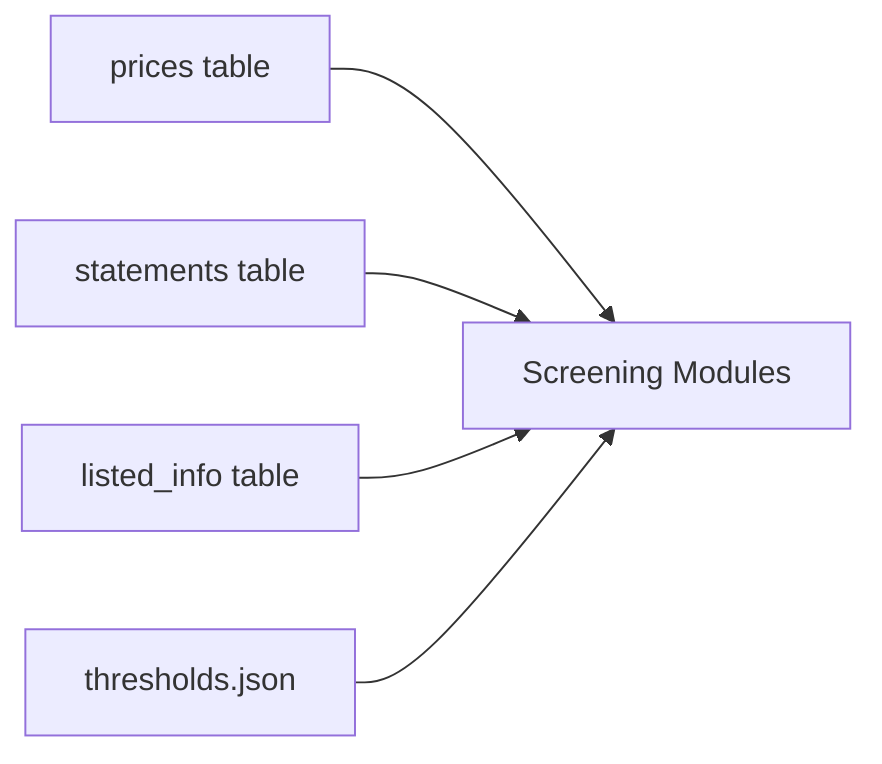
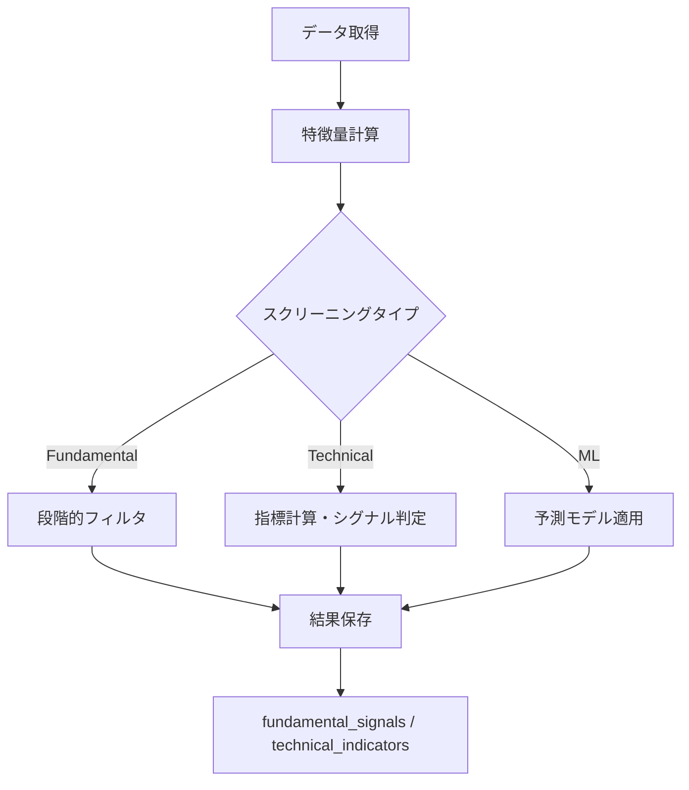

# スクリーニング機能（screening/）詳細設計書

## 1. 概要

### 1.1 目的
大量の銘柄から投資機会を効率的に発見するため、ファンダメンタル分析、テクニカル分析、機械学習の3つのアプローチでスクリーニング機能を提供する。

### 1.2 機能概要
- **ファンダメンタルスクリーニング**：財務諸表ベースの成長株発見
- **テクニカルスクリーニング**：価格パターンとモメンタムベースのシグナル検出
- **機械学習スクリーニング**：過去データから学習した予測モデルによる銘柄選定

### 1.3 設計方針
- 高速処理（並列化、ベクトル化）
- 段階的フィルタリングによる効率的な絞り込み
- 閾値の外部設定化による柔軟性
- 初回シグナル検出による新規機会の発見

## 2. アーキテクチャ

### 2.1 コンポーネント構成
```
screening/
├── screen_statements.py    # ファンダメンタルスクリーニング
├── screen_technical.py     # テクニカルスクリーニング
├── screen_ml.py           # 機械学習スクリーニング
├── thresholds.py          # 閾値管理
└── thresholds.json        # 閾値設定ファイル
```

### 2.2 共通設計
- **データソース**: SQLiteデータベース（prices, statements, listed_info）
- **出力先**: fundamental_signals, technical_indicatorsテーブル
- **設定管理**: thresholds.jsonによる閾値の一元管理

## 3. 詳細設計

### 3.1 ファンダメンタルスクリーニング（screen_statements.py）

#### 3.1.1 設計思想
成長性と財務健全性を重視した質の高い銘柄を発見する。段階的なフィルタリングにより、ノイズを除去しながら真の成長企業を抽出。

#### 3.1.2 データ構造

##### Configクラス
```python
@dataclass
class Config:
    db_path: Path = None
    lookback_days: int = 3 * 365  # 3年間のデータ使用
    recent_days: int = 7          # 7日以内の開示
    as_of: str = None            # 基準日
```

##### 計算される特徴量
```python
# 成長性指標
sales_qoq: float        # 売上高前四半期比成長率
op_qoq: float          # 営業利益前四半期比成長率
leverage: float        # 経営レバレッジ（営業利益成長率÷売上高成長率）
eps_yoy_fy: float      # 通期EPS前年同期比
eps_yoy_q: float       # 四半期EPS前年同期比
feps_revision: float   # EPS予想修正率

# 収益性指標
op_margin: float       # 営業利益率
op_margin_ma4: float   # 営業利益率4四半期移動平均

# 財務健全性
cf_quality: float      # キャッシュフロー品質（営業CF÷営業利益）
eta_delta: float       # 自己資本比率の変化
treasury_delta: float  # 自己株式数の変化

# 特殊状況
turnaround: bool       # ターンアラウンド（赤字→黒字転換）
```

#### 3.1.3 スクリーニングロジック

##### 段階的フィルタリング
```python
def screen_signals(df: pd.DataFrame, cfg: Config) -> pd.DataFrame:
    # Stage 1: 直近開示（recent_days以内）
    df = df[df['days_since_disclosed'] <= cfg.recent_days]

    # Stage 2: EPS成長率フィルタ
    df = df[(df['eps_yoy_fy'] > EPS_YOY_MIN) |
            (df['eps_yoy_q'] > EPS_YOY_MIN)]

    # Stage 3: CF品質フィルタ
    df = df[df['cf_quality'] > CF_QUALITY_MIN]

    # Stage 4: 自己資本比率改善
    df = df[df['eta_delta'] >= ETA_DELTA_MIN]

    # Stage 5: 自己株式取得制限
    df = df[df['treasury_delta'] <= TREASURY_DELTA_MAX]

    # Stage 6: ノイズ除去（会計基準変更等）
    df = remove_noise(df)

    return df
```

##### ノイズ除去ロジック
- 売上高または営業利益が前期比±300%を超える異常値を除外
- 営業利益率が前期から極端に変動（±50pt）した銘柄を除外
- ターンアラウンド銘柄は例外として保持

#### 3.1.4 出力仕様

##### データベース保存形式
```sql
INSERT OR REPLACE INTO fundamental_signals (
    code, company_name, DisclosedAt,
    NetSales, NetSales_YoY,
    OrdinaryProfit, OrdinaryProfit_YoY,
    Profit, Profit_YoY,
    EPS, EPS_FY_Est, Dividend_FY_Est,
    EquityToAssetRatio, ROE, PBR,
    close_price
) VALUES (?, ?, ?, ...)
```

### 3.2 テクニカルスクリーニング（screen_technical.py）

#### 3.2.1 設計思想
価格とボリュームのパターンから、トレンドの転換点や継続性を検出。複数の指標を組み合わせた総合判断により、ロングとショートの両方のシグナルを生成。

#### 3.2.2 技術指標の計算

##### 移動平均とトレンド
```python
# 単純移動平均（SMA）
sma5 = close.rolling(5).mean()
sma10 = close.rolling(10).mean()
sma20 = close.rolling(20).mean()
sma50 = close.rolling(50).mean()

# 移動平均の傾き（回帰係数）
slope10 = rolling_regression_slope(close, 10)
slope20 = rolling_regression_slope(close, 20)
slope50 = rolling_regression_slope(close, 50)
```

##### RSI（相対力指数）
```python
def calculate_rsi(close: pd.Series, period: int = 14) -> pd.Series:
    delta = close.diff()
    gain = (delta.where(delta > 0, 0)).rolling(period).mean()
    loss = (-delta.where(delta < 0, 0)).rolling(period).mean()
    rs = gain / loss
    rsi = 100 - (100 / (1 + rs))
    return rsi
```

##### ADX（平均方向性指数）
```python
def calculate_adx(high, low, close, period=14):
    # True Range
    tr = pd.concat([
        high - low,
        abs(high - close.shift(1)),
        abs(low - close.shift(1))
    ], axis=1).max(axis=1)

    # Directional Movement
    dm_plus = (high - high.shift(1)).where(
        (high - high.shift(1)) > (low.shift(1) - low), 0)
    dm_minus = (low.shift(1) - low).where(
        (low.shift(1) - low) > (high - high.shift(1)), 0)

    # Smoothed indicators
    atr = tr.rolling(period).mean()
    di_plus = 100 * (dm_plus.rolling(period).mean() / atr)
    di_minus = 100 * (dm_minus.rolling(period).mean() / atr)

    # ADX
    dx = 100 * abs(di_plus - di_minus) / (di_plus + di_minus)
    adx = dx.rolling(period).mean()

    return adx
```

##### ボリンジャーバンド
```python
sma20 = close.rolling(20).mean()
std20 = close.rolling(20).std()
bb_upper = sma20 + std20
bb_lower = sma20 - std20
```

##### MACD
```python
ema12 = close.ewm(span=12, adjust=False).mean()
ema26 = close.ewm(span=26, adjust=False).mean()
macd = ema12 - ema26
signal = macd.ewm(span=9, adjust=False).mean()
```

#### 3.2.3 シグナル判定ロジック

##### ロングシグナル
```python
# 移動平均パーフェクトオーダー
signal_ma = (sma5 > sma10) & (sma10 > sma20) & (sma20 > sma50)

# RSI上昇トレンド
signal_rsi = rsi >= RSI_THRESHOLD

# トレンドの強さ
signal_adx = adx >= ADX_THRESHOLD

# ボリンジャーバンドブレイクアウト
signal_bb = close >= bb_upper

# MACDゴールデンクロス
signal_macd = macd > signal

# 初回シグナル判定（過去30日間シグナルなし）
is_first_signal = ~has_signal_in_past_n_days(30)
```

##### ショートシグナル
```python
# 移動平均逆パーフェクトオーダー
signal_ma_short = (sma5 < sma10) & (sma10 < sma20) & (sma20 < sma50)

# RSI下降トレンド
signal_rsi_short = rsi <= RSI_THRESHOLD

# ボリンジャーバンド下限割れ
signal_bb_short = close <= bb_lower

# MACDデッドクロス
signal_macd_short = macd < signal
```

##### 複合スコア計算
```python
# ロングスコア（重み付け）
long_score = (
    signal_ma * 2 +      # 移動平均は重視
    signal_bb * 2 +      # ブレイクアウトも重視
    signal_rsi * 1 +
    signal_adx * 1 +
    signal_macd * 1
)

# ショートスコア
short_score = (
    signal_ma_short * 2 +
    signal_bb_short * 2 +
    signal_rsi_short * 1 +
    signal_macd_short * 1 +
    signal_adx * 1
)
```

#### 3.2.4 パフォーマンス最適化

##### 並列処理
```python
def run_indicators_fast(codes: List[str], n_workers: int = None):
    with ProcessPoolExecutor(max_workers=n_workers) as executor:
        futures = {
            executor.submit(compute_indicators_for_code, code): code
            for code in codes
        }

        for future in as_completed(futures):
            code = futures[future]
            try:
                result = future.result()
                yield result
            except Exception as e:
                log.error(f"Failed {code}: {e}")
```

##### データ型最適化
```python
# float64 → float32 変換
df[numeric_cols] = df[numeric_cols].astype('float32')

# カテゴリカル型の使用
df['side'] = pd.Categorical(df['side'], categories=['long', 'short'])
```

### 3.3 機械学習スクリーニング（screen_ml.py）

#### 3.3.1 設計思想
過去の価格パターンと財務データから、将来の株価上昇を予測。教師あり学習により、人間では発見困難な複雑なパターンを捉える。

#### 3.3.2 モデル設計

##### アルゴリズム選定
```python
# GradientBoostingClassifier採用理由
# 1. 非線形関係の学習能力
# 2. 特徴量の重要度算出
# 3. 過学習への耐性（適切なパラメータ設定）
# 4. 欠損値への対応力

model = GradientBoostingClassifier(
    n_estimators=100,
    learning_rate=0.1,
    max_depth=3,
    random_state=42
)
```

##### 特徴量エンジニアリング
```python
# 価格関連特徴量
PRICE_FEATURES = [
    'ret_5',          # 5日リターン
    'ret_10',         # 10日リターン
    'ret_20',         # 20日リターン
    'volatility_20',  # 20日ボラティリティ
    'turnover_norm'   # 正規化出来高
]

# 財務諸表特徴量（数値のみ）
NUMERIC_STMT_COLS = [
    'NetSales', 'OperatingProfit', 'OrdinaryProfit', 'Profit',
    'TotalAssets', 'NetAssets', 'EquityToAssetRatio',
    'BookValuePerShare', 'CashFlowsFromOperatingActivities',
    'CashFlowsFromInvestingActivities', 'CashFlowsFromFinancingActivities'
]

# 特徴量計算
def calculate_features(df: pd.DataFrame) -> pd.DataFrame:
    # リターン計算
    df['ret_5'] = df['close'].pct_change(5)
    df['ret_10'] = df['close'].pct_change(10)
    df['ret_20'] = df['close'].pct_change(20)

    # ボラティリティ
    df['volatility_20'] = df['ret_1'].rolling(20).std()

    # 正規化出来高（過去20日平均比）
    df['turnover_norm'] = df['volume'] / df['volume'].rolling(20).mean()

    return df
```

##### ラベル定義
```python
def create_labels(df: pd.DataFrame, threshold: float = 0.05) -> pd.Series:
    """30営業日後に+5%以上上昇したら1、それ以外は0"""
    future_return = df.groupby('code')['close'].pct_change(30).shift(-30)
    return (future_return > threshold).astype(int)
```

#### 3.3.3 学習プロセス

##### データセット構築
```python
def _build_dataset(lookback_days: int = 500) -> pd.DataFrame:
    # 価格データと財務データを結合
    # asof mergeで各時点の最新財務データを使用
    dataset = pd.merge_asof(
        price_data.sort_values('date'),
        stmt_data.sort_values('DisclosedDate'),
        left_on='date',
        right_on='DisclosedDate',
        by='code',
        direction='backward'
    )

    # 特徴量計算とラベル付け
    dataset = calculate_features(dataset)
    dataset['label'] = create_labels(dataset)

    return dataset
```

##### モデル学習
```python
def _train_model(df: pd.DataFrame) -> Pipeline:
    # 特徴量とラベルの分離
    X = df[PRICE_FEATURES + NUMERIC_STMT_COLS]
    y = df['label']

    # クラスバランスの確認
    if y.nunique() < 2:
        # 閾値を調整して最低2クラス確保
        threshold = adjust_threshold(df)
        y = create_labels(df, threshold)

    # パイプライン構築
    pipeline = Pipeline([
        ('scaler', StandardScaler()),
        ('model', GradientBoostingClassifier())
    ])

    # 学習と評価
    pipeline.fit(X, y)

    # AUCスコアの計算
    y_pred_proba = pipeline.predict_proba(X)[:, 1]
    auc = roc_auc_score(y, y_pred_proba)
    log.info(f"Training AUC: {auc:.3f}")

    return pipeline
```

#### 3.3.4 予測とスクリーニング

##### 予測実行
```python
def screen(top: int = 20, lookback_days: int = 60) -> pd.DataFrame:
    # モデルロード
    model = load_model()

    # 最新データで予測
    latest_data = prepare_latest_data(lookback_days)

    # 予測確率の計算
    probabilities = model.predict_proba(latest_data[features])[:, 1]

    # 上位N銘柄を選定
    latest_data['predict_proba'] = probabilities
    top_stocks = latest_data.nlargest(top, 'predict_proba')

    return top_stocks
```

### 3.4 閾値管理（thresholds.py）

#### 3.4.1 設計思想
スクリーニング条件を外部設定化し、市場環境や投資戦略に応じた柔軟な調整を可能にする。

#### 3.4.2 実装
```python
def load_thresholds() -> dict:
    """thresholds.jsonから設定を読み込み、デフォルト値とマージ"""
    defaults = {
        'EPS_YOY_MIN': 0.30,
        'CF_QUALITY_MIN': 0.8,
        'ETA_DELTA_MIN': 0.0,
        'TREASURY_DELTA_MAX': 0.0,
        'RSI_THRESHOLD': 50,
        'ADX_THRESHOLD': 20,
        'OVERHEAT_FACTOR': 1.1,
        'OVERSOLD_FACTOR': 0.95,
        'SIGNAL_COUNT_MIN': 3,
        'SHORT_SIGNAL_COUNT_MIN': 4,
        'FIRST_LOOKBACK_DAYS': 30
    }

    # JSONファイルから読み込み
    json_path = Path(__file__).parent / 'thresholds.json'
    if json_path.exists():
        with open(json_path) as f:
            custom = json.load(f)
        defaults.update(custom)

    return defaults
```

## 4. データフロー

### 4.1 入力データ


### 4.2 処理フロー


## 5. パフォーマンス最適化

### 5.1 並列処理
- **Technical**: ProcessPoolExecutorで銘柄単位の並列計算
- **ML**: 特徴量計算のベクトル化

### 5.2 メモリ最適化
- float64 → float32 変換
- 不要カラムの早期削除
- チャンク処理によるメモリ使用量制限

### 5.3 データベース最適化
- バッチINSERT（1000件単位）
- インデックスの活用
- トランザクション単位の調整

## 6. エラーハンドリング

### 6.1 データ品質
- 欠損値の適切な処理（forward fill, interpolation）
- 異常値の検出と除外
- ゼロ除算の回避

### 6.2 計算エラー
- 個別銘柄のエラーは記録して継続
- 全体失敗時のロールバック
- 詳細なエラーログ

## 7. 運用と保守

### 7.1 定期実行
- **Fundamental**: 毎日21:00（財務データ取得後）
- **Technical**: 毎日20:30（価格データ取得後）
- **ML**: 週次でモデル再学習

### 7.2 監視項目
- シグナル検出数の推移
- 計算時間の監視
- モデル精度（AUC）の追跡

### 7.3 チューニング
- 閾値の定期的な見直し
- 特徴量の追加・削除
- モデルハイパーパラメータの最適化

## 8. 今後の拡張計画

### 8.1 機能拡張
- リアルタイムスクリーニング
- カスタムスクリーニング条件の作成UI
- 複合スクリーニング（3手法の統合）

### 8.2 性能改善
- GPU活用（機械学習）
- インクリメンタル学習
- キャッシュ機構の導入

### 8.3 新手法の追加
- ディープラーニングモデル
- センチメント分析との統合
- 代替データの活用
