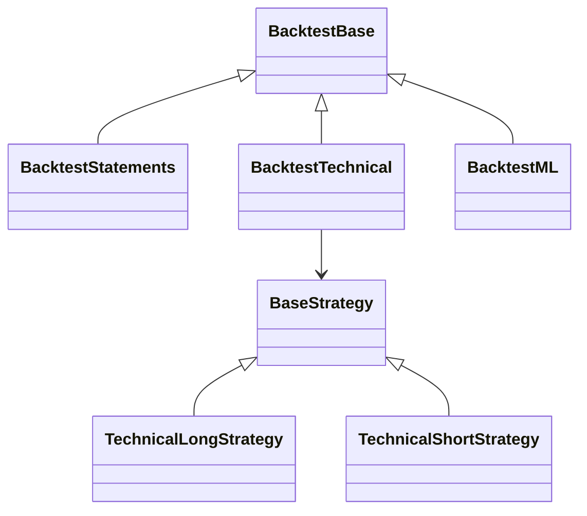
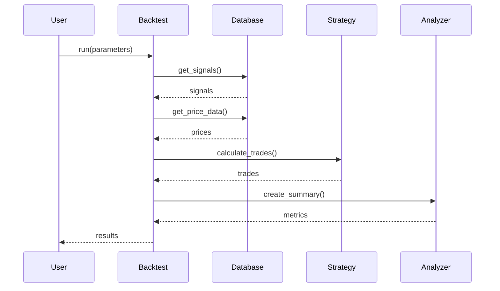

# バックテスト機能（backtest/）詳細設計書

## 1. 概要

### 1.1 目的
過去データを使用して投資戦略の有効性を検証し、リスクとリターンの特性を定量的に評価する。実際の投資判断に活用できる信頼性の高いパフォーマンス分析を提供する。

### 1.2 機能概要
- **ファンダメンタル戦略バックテスト**：財務諸表ベースのシグナルを検証
- **テクニカル戦略バックテスト**：価格パターンベースのシグナルを検証（ロング/ショート）
- **機械学習戦略バックテスト**：予測モデルベースのシグナルを検証
- **パフォーマンス分析**：包括的なメトリクスと可視化

### 1.3 設計方針
- 戦略パターンによる拡張性の確保
- 現実的な取引シミュレーション（営業日計算、取引コスト）
- リスク管理機能の組み込み（ストップロス）
- 詳細な分析とレポート機能

## 2. アーキテクチャ

### 2.1 コンポーネント構成
```
backtest/
├── base.py                    # 抽象基底クラス
├── backtest_statements.py     # ファンダメンタル戦略
├── backtest_technical.py      # テクニカル戦略
├── backtest_ml.py            # 機械学習戦略
├── technical_runner.py       # テクニカル戦略のCLIランナー
├── strategies/               # 戦略パターン実装
│   ├── base_strategy.py     # 戦略基底クラス
│   ├── technical_long.py    # ロング戦略
│   └── technical_short.py   # ショート戦略
├── analyze_backtest_json.py  # 基本分析ツール
└── analyze_json_advanced.py  # 高度な分析ツール
```

### 2.2 クラス階層


## 3. 詳細設計

### 3.1 基底クラス（base.py）

#### 3.1.1 BacktestBase クラス

##### 設計思想
すべてのバックテスト戦略の共通処理を抽象化し、一貫したインターフェースを提供。

##### クラス定義
```python
class BacktestBase(ABC):
    def __init__(
        self,
        capital: float = 1_000_000,
        hold_days: int = 60,
        start_date: str = None,
        end_date: str = None
    ):
        self.capital = capital
        self.hold_days = hold_days
        self.start_date = start_date
        self.end_date = end_date
        self.trades = []
        self.summary = []
```

##### 主要メソッド

###### run() - バックテスト実行
```python
def run(self, save_to: str = None, show: bool = False) -> dict:
    """バックテストの実行フロー"""
    # 1. シグナル取得（サブクラスで実装）
    signals = self.get_signals()

    # 2. 価格データ取得
    price_data = self._get_price_data(signals)

    # 3. 取引計算
    self.trades = self.calculate_trades(signals, price_data)

    # 4. サマリー作成
    self.summary = self.create_summary(self.trades)

    # 5. 結果保存
    if save_to:
        self.save_results(save_to)

    # 6. 結果表示
    if show:
        self.display_results()

    return {"summary": self.summary, "trades": self.trades}
```

###### calculate_trades() - 取引計算
```python
def calculate_trades(
    self,
    signals: pd.DataFrame,
    price_data: pd.DataFrame
) -> List[dict]:
    """各シグナルに対する取引を計算"""
    trades = []

    for _, signal in signals.iterrows():
        trade = self._calculate_single_trade(signal, price_data)
        if trade:
            trades.append(trade)

    return trades
```

###### create_summary() - パフォーマンスサマリー
```python
def create_summary(self, trades: List[dict]) -> List[dict]:
    """主要パフォーマンス指標を計算"""
    if not trades:
        return []

    df_trades = pd.DataFrame(trades)

    summary = [
        {"metric": "資本金", "value": self.capital},
        {"metric": "取引数", "value": len(trades)},
        {"metric": "勝率", "value": (df_trades['profit'] > 0).mean() * 100},
        {"metric": "合計損益", "value": df_trades['profit'].sum()},
        {"metric": "平均リターン", "value": df_trades['return'].mean()},
        {"metric": "シャープレシオ", "value": self._calculate_sharpe(df_trades)}
    ]

    return summary
```

### 3.2 ファンダメンタル戦略（backtest_statements.py）

#### 3.2.1 設計思想
決算発表後の市場反応を捉え、中長期的な成長を享受する戦略。営業日ベースの正確な取引シミュレーション。

#### 3.2.2 エントリー/エグジットロジック
```python
def run_backtest(
    df_signals: pd.DataFrame,
    df_prices: pd.DataFrame,
    hold_days: int = 60,
    capital: float = 1_000_000,
    entry_offset: int = 1
) -> dict:
    """ファンダメンタル戦略のバックテスト実行"""

    for _, signal in df_signals.iterrows():
        # エントリー日: 決算開示日 + entry_offset営業日
        entry_date = add_n_trading_days(
            signal['DisclosedAt'],
            entry_offset,
            trading_days
        )

        # エグジット日: エントリー日 + hold_days営業日
        exit_date = add_n_trading_days(
            entry_date,
            hold_days,
            trading_days
        )

        # 価格データから取引計算
        entry_price = get_price(df_prices, signal['code'], entry_date)
        exit_price = get_price(df_prices, signal['code'], exit_date)

        if entry_price and exit_price:
            trades.append(calculate_trade(signal, entry_price, exit_price))
```

#### 3.2.3 特殊機能
- **営業日カレンダー**: 土日祝日を除外した正確な日付計算
- **最低価格フィルター**: 低位株（デフォルト300円未満）を除外
- **ASCII可視化**: ターミナルでの損益分布表示

### 3.3 テクニカル戦略（backtest_technical.py）

#### 3.3.1 設計思想
短期的な価格モメンタムとトレンドを捉える戦略。ロングとショートの両方に対応し、リスク管理を重視。

#### 3.3.2 エントリー条件

##### ロング戦略
```python
def get_long_signals(df: pd.DataFrame) -> pd.DataFrame:
    """ロングエントリーシグナルの抽出"""
    conditions = (
        (df['signal_count'] >= 3) &           # 3つ以上のシグナル
        (df['signal_first'] == 1) &           # 初回シグナル
        (df['overheat'] == 0) &              # 過熱していない
        (df['oversold'] == 0)                # 売られ過ぎでない
    )
    return df[conditions]
```

##### ショート戦略
```python
def get_short_signals(df: pd.DataFrame) -> pd.DataFrame:
    """ショートエントリーシグナルの抽出"""
    conditions = (
        (df['signal_count_short'] >= 4) &     # 4つ以上のシグナル
        (df['signal_first_short'] == 1) &     # 初回シグナル
        (df['oversold'] == 0)                # 売られ過ぎでない
    )
    return df[conditions]
```

#### 3.3.3 リスク管理

##### ストップロス実装
```python
def calculate_trade_with_stop_loss(
    entry_price: float,
    stop_loss_pct: float = 0.05
) -> dict:
    """ストップロス付き取引計算"""

    # ロングの場合
    stop_price_long = entry_price * (1 - stop_loss_pct)

    # ショートの場合
    stop_price_short = entry_price * (1 + stop_loss_pct)

    # 日次でストップロス判定
    for date in trading_days:
        daily_price = get_price(date)

        if (side == 'long' and daily_price <= stop_price_long) or \
           (side == 'short' and daily_price >= stop_price_short):
            # ストップロス執行
            return calculate_exit(stop_price)
```

#### 3.3.4 戦略パターンの活用
```python
# strategies/base_strategy.py
class BaseStrategy(ABC):
    @abstractmethod
    def get_entry_signal(self, df: pd.DataFrame) -> pd.DataFrame:
        """エントリーシグナルの取得"""
        pass

    @abstractmethod
    def calculate_profit(self, entry: float, exit: float) -> float:
        """利益計算"""
        pass

    @abstractmethod
    def get_stop_price(self, entry: float) -> float:
        """ストップ価格の計算"""
        pass
```

### 3.4 機械学習戦略（backtest_ml.py）

#### 3.4.1 設計思想
過去データから学習したパターンを活用し、将来の価格上昇確率が高い銘柄を選定。動的なポートフォリオ管理。

#### 3.4.2 実装アプローチ
```python
def run_backtest(
    start_date: str,
    end_date: str,
    top_n: int = 20,
    capital: float = 1_000_000,
    lookback_days: int = 60
) -> dict:
    """ML戦略のバックテスト"""

    results = []
    current_date = start_date

    while current_date <= end_date:
        # 1. 過去データでモデル学習
        model = train_model(current_date, lookback_days)

        # 2. 予測スコア計算
        predictions = model.predict_proba(latest_data)

        # 3. 上位N銘柄選定
        top_stocks = select_top_n(predictions, top_n)

        # 4. ポジション構築
        positions = build_positions(top_stocks, capital)

        # 5. 保有期間後の評価
        results.append(evaluate_positions(positions))

        current_date = next_trading_day(current_date)
```

#### 3.4.3 特徴量の活用
- **価格特徴量**: モメンタム、ボラティリティ
- **財務特徴量**: 成長性、収益性指標
- **複合スコア**: 両特徴量を統合した予測

### 3.5 パフォーマンス分析

#### 3.5.1 基本分析（analyze_backtest_json.py）

##### 主要メトリクス
```python
def calculate_metrics(trades: List[dict]) -> dict:
    """基本的なパフォーマンス指標を計算"""

    metrics = {
        'total_trades': len(trades),
        'winning_trades': sum(1 for t in trades if t['profit'] > 0),
        'win_rate': winning_trades / total_trades * 100,
        'total_profit': sum(t['profit'] for t in trades),
        'avg_return': np.mean([t['return'] for t in trades]),
        'sharpe_ratio': avg_return / np.std([t['return'] for t in trades])
    }

    return metrics
```

##### ASCII可視化
```python
def create_ascii_chart(profits: List[float]) -> str:
    """損益分布のASCII棒グラフ"""
    bins = np.histogram(profits, bins=20)

    chart = "Profit Distribution:\n"
    for i, count in enumerate(bins[0]):
        bar = '#' * int(count / max(bins[0]) * 50)
        chart += f"{bins[1][i]:8.0f} | {bar}\n"

    return chart
```

#### 3.5.2 高度な分析（analyze_json_advanced.py）

##### 追加メトリクス
```python
class AdvancedAnalyzer:
    def calculate_advanced_metrics(self) -> dict:
        """高度なパフォーマンス指標"""

        return {
            'max_drawdown': self._calculate_max_drawdown(),
            'calmar_ratio': annual_return / max_drawdown,
            'profit_factor': avg_profit / avg_loss,
            'recovery_factor': total_profit / max_drawdown,
            'avg_holding_days': np.mean(holding_periods),
            'best_trade': max(profits),
            'worst_trade': min(profits),
            'consecutive_wins': self._max_consecutive_wins(),
            'consecutive_losses': self._max_consecutive_losses()
        }
```

##### 可視化機能
```python
def create_visualizations(self):
    """包括的な可視化レポート"""

    fig, axes = plt.subplots(2, 3, figsize=(15, 10))

    # 1. 累積リターン
    self._plot_cumulative_returns(axes[0, 0])

    # 2. ドローダウン
    self._plot_drawdown(axes[0, 1])

    # 3. リターン分布
    self._plot_return_distribution(axes[0, 2])

    # 4. 月次パフォーマンス
    self._plot_monthly_performance(axes[1, 0])

    # 5. 勝敗パターン
    self._plot_win_loss_pattern(axes[1, 1])

    # 6. ローリング統計
    self._plot_rolling_stats(axes[1, 2])
```

## 4. データフロー

### 4.1 バックテスト実行フロー


### 4.2 取引計算フロー
```python
def trade_calculation_flow(signal, prices):
    """取引計算の詳細フロー"""

    # 1. エントリー価格取得
    entry_price = get_entry_price(signal, prices)
    if not entry_price:
        return None

    # 2. ポジションサイズ計算
    position_size = calculate_position_size(entry_price, capital)

    # 3. ストップロス設定
    stop_loss_price = calculate_stop_loss(entry_price, strategy)

    # 4. 保有期間中の監視
    for day in holding_period:
        current_price = prices[day]

        # ストップロス判定
        if should_stop_loss(current_price, stop_loss_price):
            return create_trade_result(entry_price, stop_loss_price, 'stop_loss')

    # 5. 通常エグジット
    exit_price = get_exit_price(signal, prices, hold_days)
    return create_trade_result(entry_price, exit_price, 'normal')
```

## 5. 出力仕様

### 5.1 JSON形式
```json
{
    "metadata": {
        "backtest_name": "Fundamental Strategy 2024",
        "capital": 1000000,
        "hold_days": 60,
        "start_date": "2024-01-01",
        "end_date": "2024-12-31",
        "timestamp": "2025-01-12T10:00:00",
        "parameters": {
            "stop_loss": 0.05,
            "entry_offset": 1
        }
    },
    "summary": [
        {"metric": "総取引数", "value": 150},
        {"metric": "勝率", "value": 65.3},
        {"metric": "合計損益", "value": 523400},
        {"metric": "平均リターン", "value": 3.5},
        {"metric": "シャープレシオ", "value": 1.2},
        {"metric": "最大ドローダウン", "value": -8.5}
    ],
    "trades": [
        {
            "code": "1301",
            "name": "極洋",
            "entry_date": "2024-01-10",
            "exit_date": "2024-03-10",
            "entry_price": 3500,
            "exit_price": 3850,
            "shares": 300,
            "return_pct": 10.0,
            "profit": 105000,
            "exit_reason": "normal",
            "holding_days": 60
        }
    ],
    "monthly_performance": {
        "2024-01": {"trades": 12, "profit": 45000},
        "2024-02": {"trades": 10, "profit": -12000}
    }
}
```

### 5.2 Excel形式

#### シート構成
1. **Summary**: 主要指標とパラメータ
2. **Trades**: 全取引の詳細
3. **Monthly**: 月次パフォーマンス
4. **Statistics**: 詳細統計
5. **Risk Metrics**: リスク指標

#### フォーマット
- 自動列幅調整
- 条件付き書式（損益の色分け）
- チャート埋め込み（advanced版）

## 6. パフォーマンス最適化

### 6.1 データ処理
- numpy配列によるベクトル化計算
- pandas groupbyの効率的な使用
- 大規模データのチャンク処理

### 6.2 メモリ管理
- 不要なデータの早期削除
- データ型の最適化（float64→float32）
- ジェネレータの活用

## 7. エラーハンドリング

### 7.1 データ品質
- 価格データの欠損値処理
- 異常値の検出と除外
- 取引不可能日の処理

### 7.2 計算エラー
- ゼロ除算の防止
- 数値オーバーフローの対策
- NaN/Inf値の適切な処理

## 8. 運用と保守

### 8.1 実行方法
```bash
# ファンダメンタル戦略
python backtest/backtest_statements.py --hold 60 --capital 1000000

# テクニカル戦略（ロング）
python backtest/backtest_technical.py --side long --stop-loss 0.05

# 機械学習戦略
python backtest/backtest_ml.py --top 20 --lookback 60

# 結果分析
python backtest/analyze_backtest_json.py result.json --show-trades
python backtest/analyze_json_advanced.py result.json --export pdf
```

### 8.2 監視項目
- 実行時間とメモリ使用量
- データ取得の完全性
- 異常な取引結果の検出

## 9. 今後の拡張計画

### 9.1 機能拡張
- リアルタイムバックテスト
- モンテカルロシミュレーション
- ポートフォリオ最適化
- 取引コストモデルの精緻化

### 9.2 性能改善
- 並列処理の導入
- キャッシュ機構
- インクリメンタル計算

### 9.3 分析機能
- What-If分析
- センシティビティ分析
- リスクパリティ配分
- 機械学習による最適パラメータ探索
