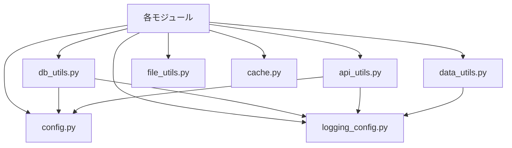

# ユーティリティ機能（src/utils/ & src/config/）詳細設計書

## 1. 概要

### 1.1 目的
プロジェクト全体で使用される共通機能を提供し、コードの重複を避け、保守性と拡張性を向上させる。統一的なインターフェースにより、開発効率を高める。

### 1.2 機能概要
- **設定管理**：プロジェクト全体の設定を一元管理
- **ログ管理**：統一的なログ出力とローテーション
- **データベース操作**：効率的で安全なDB操作
- **API通信**：J-Quants APIとの通信管理
- **データ処理**：共通のデータ変換・計算処理
- **ファイル管理**：標準化されたファイル入出力
- **キャッシュ**：パフォーマンス向上のためのメモリキャッシュ

### 1.3 設計方針
- DRY原則（Don't Repeat Yourself）の徹底
- 疎結合と高凝集
- エラーハンドリングの統一
- パフォーマンスの最適化

## 2. アーキテクチャ

### 2.1 コンポーネント構成
```
src/
├── config/
│   └── config.py          # 設定管理
└── utils/
    ├── logging_config.py  # ログ設定
    ├── db_utils.py       # DB操作ユーティリティ
    ├── api_utils.py      # API通信ユーティリティ
    ├── data_utils.py     # データ処理ユーティリティ
    ├── file_utils.py     # ファイル操作ユーティリティ
    └── cache.py          # キャッシュ機能
```

### 2.2 依存関係


## 3. 詳細設計

### 3.1 設定管理（src/config/config.py）

#### 3.1.1 設計思想
プロジェクト全体の設定を一元管理し、環境による差異を吸収。設定ファイルと環境変数の両方をサポート。

#### 3.1.2 Config クラス
```python
class Config:
    """プロジェクト設定管理クラス"""

    def __init__(self):
        self._config = self._load_config()
        self._project_root = Path(__file__).parent.parent.parent

    def _load_config(self) -> dict:
        """config/config.json から設定を読み込み"""
        config_path = Path(__file__).parent / "config.json"

        if config_path.exists():
            with open(config_path, "r", encoding="utf-8") as f:
                return json.load(f)

        # デフォルト設定
        return {
            "database": {"path": "db/stock.db"},
            "api": {
                "base_url": "https://jpx-jquants.com/v1",
                "timeout": 60,
                "retry_count": 3
            },
            "scheduler": {
                "quotes_schedule": "20:00",
                "statements_schedule": "20:30",
                "listed_schedule": "monday 06:00"
            },
            "output": {
                "base_dir": "data/output",
                "formats": ["json", "xlsx"]
            }
        }
```

#### 3.1.3 主要メソッド

##### データベースパス取得
```python
@property
def db_path(self) -> Path:
    """データベースパスを取得（環境変数優先）"""
    # テスト環境対応
    if env_path := os.environ.get("DATABASE_PATH"):
        return Path(env_path)

    return self._project_root / self._config["database"]["path"]
```

##### API エンドポイント取得
```python
def get_api_endpoint(self, endpoint: str) -> str:
    """APIエンドポイントのフルURLを返す"""
    endpoints = {
        "daily_quotes": "/prices/daily_quotes",
        "statements": "/statements",
        "listed_info": "/listed/info",
        "auth_user": "/token/auth_user",
        "auth_refresh": "/token/auth_refresh"
    }

    if endpoint not in endpoints:
        raise ValueError(f"Unknown endpoint: {endpoint}")

    return f"{self.api_base_url}{endpoints[endpoint]}"
```

##### 認証情報取得
```python
def get_idtoken(self) -> str:
    """IDトークンを取得"""
    token_path = self._project_root / "config/idtoken.json"

    if not token_path.exists():
        raise RuntimeError("IDトークンが見つかりません。update_idtoken.pyを実行してください。")

    with open(token_path, "r") as f:
        data = json.load(f)

    # 有効期限チェック（オプション）
    if "expires_at" in data:
        expires_at = datetime.fromisoformat(data["expires_at"])
        if expires_at < datetime.now():
            raise RuntimeError("IDトークンの有効期限が切れています。")

    return data["idToken"]
```

### 3.2 ログ管理（logging_config.py）

#### 3.2.1 設計思想
プロジェクト全体で統一的なログフォーマットとローテーション設定を提供。モジュールごとに適切なロガーを生成。

#### 3.2.2 ロガー設定
```python
def get_logger(name: str) -> logging.Logger:
    """統一的な設定が適用されたロガーを取得"""
    logger = logging.getLogger(name)

    # 既に設定済みの場合はそのまま返す
    if logger.handlers:
        return logger

    logger.setLevel(logging.INFO)

    # ログディレクトリ作成
    log_dir = Path("data/logs")
    log_dir.mkdir(parents=True, exist_ok=True)

    # フォーマッター
    formatter = logging.Formatter(
        "%(asctime)s - %(name)s - %(levelname)s - %(message)s"
    )

    # 日次ローテーションハンドラー
    daily_handler = TimedRotatingFileHandler(
        log_dir / f"{name}.log",
        when="midnight",
        interval=1,
        backupCount=30,  # 30日分保持
        encoding="utf-8"
    )
    daily_handler.setFormatter(formatter)

    # サイズベースローテーションハンドラー
    size_handler = RotatingFileHandler(
        log_dir / f"{name}_size.log",
        maxBytes=100 * 1024 * 1024,  # 100MB
        backupCount=5,
        encoding="utf-8"
    )
    size_handler.setFormatter(formatter)

    # コンソールハンドラー（開発環境）
    if os.environ.get("ENV") != "production":
        console_handler = logging.StreamHandler()
        console_handler.setFormatter(formatter)
        logger.addHandler(console_handler)

    logger.addHandler(daily_handler)
    logger.addHandler(size_handler)

    return logger
```

### 3.3 データベース操作（db_utils.py）

#### 3.3.1 設計思想
SQLite操作の共通処理を提供し、パフォーマンス最適化とエラーハンドリングを統一。

#### 3.3.2 接続管理
```python
@contextmanager
def get_db_connection():
    """データベース接続のコンテキストマネージャー"""
    from src.config import get_db_path

    conn = None
    try:
        conn = sqlite3.connect(
            get_db_path(),
            timeout=30.0,
            isolation_level="DEFERRED"
        )

        # パフォーマンス最適化
        conn.execute("PRAGMA journal_mode = WAL")
        conn.execute("PRAGMA synchronous = NORMAL")
        conn.execute("PRAGMA cache_size = -64000")      # 64MB
        conn.execute("PRAGMA temp_store = MEMORY")
        conn.execute("PRAGMA mmap_size = 268435456")    # 256MB

        yield conn
        conn.commit()

    except Exception as e:
        if conn:
            conn.rollback()
        log.error(f"Database error: {e}")
        raise
    finally:
        if conn:
            conn.close()
```

#### 3.3.3 バッチ処理
```python
def execute_many(
    query: str,
    params: List[tuple],
    batch_size: int = 1000
) -> int:
    """複数のパラメータで同じクエリを実行（バッチ処理対応）"""
    total_affected = 0

    with get_db_connection() as conn:
        cursor = conn.cursor()

        # バッチ処理
        for i in range(0, len(params), batch_size):
            batch = params[i:i + batch_size]
            cursor.executemany(query, batch)
            total_affected += cursor.rowcount

            # 大量データの場合、定期的にコミット
            if i > 0 and i % (batch_size * 10) == 0:
                conn.commit()
                log.info(f"Processed {i} records...")

    return total_affected
```

#### 3.3.4 DataFrame 操作
```python
def upsert_dataframe(
    df: pd.DataFrame,
    table_name: str,
    unique_columns: List[str],
    batch_size: int = 1000
) -> int:
    """DataFrameの内容をUPSERT"""
    if df.empty:
        return 0

    # カラム名とプレースホルダー生成
    columns = df.columns.tolist()
    placeholders = ",".join(["?" for _ in columns])
    column_names = ",".join(columns)

    # UPSERT クエリ構築
    update_clause = ",".join([
        f"{col} = excluded.{col}"
        for col in columns
        if col not in unique_columns
    ])

    query = f"""
    INSERT INTO {table_name} ({column_names})
    VALUES ({placeholders})
    ON CONFLICT ({",".join(unique_columns)})
    DO UPDATE SET {update_clause}
    """

    # データをタプルのリストに変換
    params = [tuple(row) for row in df.values]

    return execute_many(query, params, batch_size)
```

### 3.4 API通信（api_utils.py）

#### 3.4.1 設計思想
J-Quants API との通信を統一的に管理。レート制限、リトライ、ページネーションを自動処理。

#### 3.4.2 APIクライアント
```python
class JQuantsAPIClient:
    """J-Quants API 統一クライアント"""

    def __init__(self, rate_limit_wait: float = 0.35):
        self.session = requests.Session()
        self.rate_limit_wait = rate_limit_wait
        self.last_request_time = 0
        self.retry_count = 3
        self.retry_status_codes = {429, 500, 502, 503, 504}

        # デフォルトヘッダー
        self.session.headers.update({
            "User-Agent": "swing-trader/1.0",
            "Accept": "application/json"
        })

    def _wait_for_rate_limit(self):
        """レート制限のための待機"""
        elapsed = time.time() - self.last_request_time
        if elapsed < self.rate_limit_wait:
            time.sleep(self.rate_limit_wait - elapsed)
        self.last_request_time = time.time()

    def _get_headers(self) -> dict:
        """認証ヘッダーを含むヘッダーを取得"""
        from src.config import get_idtoken

        return {
            **self.session.headers,
            "Authorization": f"Bearer {get_idtoken()}"
        }
```

#### 3.4.3 ページネーション対応
```python
def get_with_pagination(
    self,
    endpoint: str,
    params: dict = None,
    data_key: str = None
) -> pd.DataFrame:
    """ページネーション対応のGETリクエスト"""
    all_data = []
    params = params or {}

    while True:
        # レート制限
        self._wait_for_rate_limit()

        # リトライ付きリクエスト
        for attempt in range(self.retry_count):
            try:
                response = self.session.get(
                    endpoint,
                    params=params,
                    headers=self._get_headers(),
                    timeout=60
                )

                if response.status_code in self.retry_status_codes and attempt < self.retry_count - 1:
                    wait_time = (attempt + 1) ** 2  # Exponential backoff
                    log.warning(f"Retry after {wait_time}s (attempt {attempt + 1})")
                    time.sleep(wait_time)
                    continue

                response.raise_for_status()
                break

            except requests.exceptions.RequestException as e:
                if attempt == self.retry_count - 1:
                    raise
                log.warning(f"Request failed: {e}")

        # データ抽出
        data = response.json()

        if data_key:
            page_data = data.get(data_key, [])
        else:
            page_data = data

        if not page_data:
            break

        all_data.extend(page_data)

        # 次のページチェック
        pagination_key = data.get("pagination_key")
        if not pagination_key:
            break

        params["pagination_key"] = pagination_key

    return pd.DataFrame(all_data)
```

### 3.5 データ処理（data_utils.py）

#### 3.5.1 設計思想
頻繁に使用されるデータ変換・計算処理を標準化。営業日計算、リターン計算、パフォーマンス指標の計算を提供。

#### 3.5.2 DataProcessor クラス
```python
class DataProcessor:
    """共通データ処理ユーティリティ"""

    @staticmethod
    def normalize_types(
        df: pd.DataFrame,
        numeric_cols: List[str] = None,
        date_cols: List[str] = None,
        bool_cols: List[str] = None
    ) -> pd.DataFrame:
        """データ型の正規化"""
        df = df.copy()

        # 数値型変換
        if numeric_cols:
            for col in numeric_cols:
                if col in df.columns:
                    df[col] = pd.to_numeric(df[col], errors="coerce")

        # 日付型変換
        if date_cols:
            for col in date_cols:
                if col in df.columns:
                    df[col] = pd.to_datetime(df[col], errors="coerce")

        # ブール型変換
        if bool_cols:
            for col in bool_cols:
                if col in df.columns:
                    df[col] = df[col].astype(bool)

        return df
```

#### 3.5.3 営業日計算
```python
@staticmethod
def add_trading_days(
    date: Union[str, datetime],
    days: int,
    calendar: pd.DatetimeIndex = None
) -> str:
    """営業日ベースで日付を加算"""
    if isinstance(date, str):
        date = pd.to_datetime(date)

    # デフォルトの営業日カレンダー
    if calendar is None:
        # 日本の祝日を考慮したカスタムカレンダー
        calendar = pd.bdate_range(
            start=date - pd.Timedelta(days=365),
            end=date + pd.Timedelta(days=365),
            freq="C",  # カスタム営業日
            weekmask="Mon Tue Wed Thu Fri"
        )

    # 現在の日付のインデックスを取得
    try:
        current_idx = calendar.get_loc(date)
    except KeyError:
        # 営業日でない場合は次の営業日を取得
        current_idx = calendar.searchsorted(date)

    # N営業日後のインデックス
    target_idx = current_idx + days

    # 範囲チェック
    if target_idx < 0 or target_idx >= len(calendar):
        raise ValueError(f"営業日計算の範囲外: {days}日")

    return calendar[target_idx].strftime("%Y-%m-%d")
```

#### 3.5.4 パフォーマンス指標
```python
@staticmethod
def calculate_performance_metrics(
    returns: pd.Series,
    risk_free_rate: float = 0.0
) -> dict:
    """パフォーマンス指標を計算"""
    if returns.empty:
        return {
            "total_return": 0.0,
            "annualized_return": 0.0,
            "volatility": 0.0,
            "sharpe_ratio": 0.0,
            "max_drawdown": 0.0,
            "win_rate": 0.0
        }

    # 基本統計
    total_return = (1 + returns).prod() - 1
    mean_return = returns.mean()
    std_return = returns.std()

    # 年率換算（252営業日）
    annualized_return = (1 + mean_return) ** 252 - 1
    annualized_vol = std_return * np.sqrt(252)

    # シャープレシオ
    sharpe_ratio = (annualized_return - risk_free_rate) / annualized_vol if annualized_vol > 0 else 0

    # 最大ドローダウン
    cumulative = (1 + returns).cumprod()
    running_max = cumulative.expanding().max()
    drawdown = (cumulative - running_max) / running_max
    max_drawdown = drawdown.min()

    # 勝率
    win_rate = (returns > 0).mean()

    return {
        "total_return": total_return,
        "annualized_return": annualized_return,
        "volatility": annualized_vol,
        "sharpe_ratio": sharpe_ratio,
        "max_drawdown": max_drawdown,
        "win_rate": win_rate
    }
```

### 3.6 ファイル操作（file_utils.py）

#### 3.6.1 設計思想
プロジェクト全体で統一的なファイル出力管理。タイムスタンプ付きファイル名の自動生成。

#### 3.6.2 出力パス管理
```python
def get_output_path(category: str, base_name: str, extension: str) -> Path:
    """統一的な出力パスを生成"""
    # カテゴリ別ディレクトリ
    category_dirs = {
        "backtest": "data/output/backtest",
        "screening": "data/output/screening",
        "reports": "data/output/reports",
        "exports": "data/output/exports"
    }

    if category not in category_dirs:
        raise ValueError(f"Unknown category: {category}")

    # ディレクトリ作成
    output_dir = Path(category_dirs[category])
    output_dir.mkdir(parents=True, exist_ok=True)

    # タイムスタンプ付きファイル名
    timestamp = datetime.now().strftime("%Y%m%d_%H%M%S")
    filename = f"{base_name}_{timestamp}{extension}"

    return output_dir / filename
```

#### 3.6.3 Excel 出力
```python
def save_to_excel(
    data: Union[pd.DataFrame, Dict[str, pd.DataFrame]],
    filepath: Path,
    auto_adjust_columns: bool = True
) -> None:
    """データをExcelファイルに保存（フォーマット付き）"""
    with pd.ExcelWriter(filepath, engine="xlsxwriter") as writer:
        # 単一のDataFrameの場合
        if isinstance(data, pd.DataFrame):
            data = {"Sheet1": data}

        # 各シートに書き込み
        for sheet_name, df in data.items():
            df.to_excel(writer, sheet_name=sheet_name, index=False)

            if auto_adjust_columns:
                # 列幅自動調整
                worksheet = writer.sheets[sheet_name]

                for idx, col in enumerate(df.columns):
                    max_len = max(
                        df[col].astype(str).map(len).max(),
                        len(col)
                    ) + 2
                    worksheet.set_column(idx, idx, min(max_len, 50))
```

### 3.7 キャッシュ機能（cache.py）

#### 3.7.1 設計思想
頻繁にアクセスされるデータのメモリキャッシュを提供。TTL（Time To Live）による自動期限切れ管理。

#### 3.7.2 MemoryCache クラス
```python
class MemoryCache:
    """シンプルなインメモリキャッシュ実装"""

    def __init__(self):
        self._cache: Dict[str, CacheEntry] = {}
        self._lock = threading.Lock()

    def get(self, key: str) -> Any:
        """キャッシュから値を取得"""
        with self._lock:
            if key not in self._cache:
                return None

            entry = self._cache[key]

            # 期限切れチェック
            if entry.expires_at and entry.expires_at < time.time():
                del self._cache[key]
                return None

            return entry.value

    def set(self, key: str, value: Any, ttl: int = 300) -> None:
        """キャッシュに値を設定（TTL秒）"""
        with self._lock:
            expires_at = time.time() + ttl if ttl else None
            self._cache[key] = CacheEntry(value, expires_at)

    def cleanup(self) -> int:
        """期限切れのエントリをクリーンアップ"""
        with self._lock:
            now = time.time()
            expired_keys = [
                k for k, v in self._cache.items()
                if v.expires_at and v.expires_at < now
            ]

            for key in expired_keys:
                del self._cache[key]

            return len(expired_keys)
```

#### 3.7.3 デコレータ
```python
def cache_result(ttl: int = 300, key_prefix: str = None):
    """関数の結果をキャッシュするデコレータ"""
    def decorator(func):
        @wraps(func)
        def wrapper(*args, **kwargs):
            # キャッシュキー生成
            cache_key = get_cache_key(func, args, kwargs, key_prefix)

            # キャッシュから取得
            cached = cache.get(cache_key)
            if cached is not None:
                return cached

            # 関数実行
            result = func(*args, **kwargs)

            # キャッシュに保存
            cache.set(cache_key, result, ttl)

            return result

        return wrapper
    return decorator
```

## 4. エラーハンドリング

### 4.1 統一的なエラー処理
```python
class SwingError(Exception):
    """基底例外クラス"""
    pass

class ConfigError(SwingError):
    """設定関連のエラー"""
    pass

class DatabaseError(SwingError):
    """データベース関連のエラー"""
    pass

class APIError(SwingError):
    """API通信関連のエラー"""
    pass

class DataError(SwingError):
    """データ処理関連のエラー"""
    pass
```

### 4.2 エラーログ
```python
def log_exception(e: Exception, context: str = None):
    """例外を詳細にログ出力"""
    log = get_logger("error")

    error_info = {
        "type": type(e).__name__,
        "message": str(e),
        "context": context,
        "traceback": traceback.format_exc()
    }

    log.error(json.dumps(error_info, ensure_ascii=False, indent=2))
```

## 5. パフォーマンス最適化

### 5.1 データベース
- WAL モードによる並行読み書き
- 適切なキャッシュサイズ設定
- バッチ処理による大量データの効率的な処理

### 5.2 API通信
- セッションの再利用
- レート制限の遵守
- リトライ戦略による一時的エラーの回避

### 5.3 メモリ管理
- 大規模データのチャンク処理
- 不要なデータの早期解放
- キャッシュによる重複計算の回避

## 6. テスト戦略

### 6.1 単体テスト
```python
# tests/test_utils.py
class TestDataProcessor:
    def test_add_trading_days(self):
        """営業日計算のテスト"""
        result = DataProcessor.add_trading_days("2024-01-01", 5)
        assert result == "2024-01-08"  # 週末を除く5営業日後

    def test_calculate_returns(self):
        """リターン計算のテスト"""
        prices = pd.Series([100, 110, 105, 115])
        returns = DataProcessor.calculate_returns(prices)
        assert len(returns) == 3
        assert returns.iloc[0] == 0.1  # 10%上昇
```

### 6.2 統合テスト
- データベース接続テスト
- API通信テスト（モック使用）
- ファイル入出力テスト

## 7. 運用と保守

### 7.1 設定管理
- 環境別設定ファイル（dev/staging/prod）
- 環境変数による上書き
- 設定値の検証

### 7.2 ログ監視
- エラーログの定期確認
- パフォーマンスメトリクスの収集
- アラート設定

## 8. 今後の拡張計画

### 8.1 機能拡張
- Redis によるキャッシュの永続化
- 非同期処理のサポート
- プラグインシステムの導入

### 8.2 性能改善
- データベースコネクションプーリング
- API クライアントの非同期化
- より効率的なデータ構造の採用

### 8.3 開発支援
- 型ヒントの完全対応
- ドキュメント自動生成
- パフォーマンスプロファイリング
