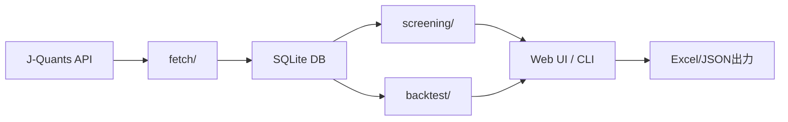

# Swing プロジェクト詳細設計書

## 概要

このディレクトリには、Swing プロジェクトの各モジュールの詳細設計書が含まれています。Swing は J-Quants API を使用した日本株式市場分析ツールキットで、データ取得からスクリーニング、バックテスト、ポートフォリオ管理まで包括的な機能を提供します。

## 設計書一覧

### 1. [データ取得機能（fetch/）](01_fetch_module.md)
J-Quants API から市場データを取得する機能の詳細設計。
- 日次株価データ取得
- 上場企業情報取得
- 財務諸表データ取得
- レート制限とエラーハンドリング

### 2. [データベース管理機能（db/）](02_database_module.md)
SQLite データベースの管理と操作に関する詳細設計。
- スキーマ定義（13テーブル）
- インデックス設計
- マイグレーション機能
- パフォーマンス最適化

### 3. [スクリーニング機能（screening/）](03_screening_module.md)
銘柄選定のための各種スクリーニング手法の詳細設計。
- ファンダメンタルスクリーニング
- テクニカルスクリーニング
- 機械学習スクリーニング
- 閾値管理システム

### 4. [バックテスト機能（backtest/）](04_backtest_module.md)
投資戦略の検証とパフォーマンス分析の詳細設計。
- ファンダメンタル戦略
- テクニカル戦略（ロング/ショート）
- 機械学習戦略
- リスク管理とパフォーマンス分析

### 5. [Web UI機能（src/ui/）](05_web_ui_module.md)
Flask ベースの Web インターフェースの詳細設計。
- 認証・認可システム
- タブ型インターフェース
- RESTful API 設計
- ポートフォリオ管理機能

### 6. [CLI機能（src/cli/）](06_cli_module.md)
コマンドラインツールとスケジューラーの詳細設計。
- 定期実行スケジューラー
- 認証トークン管理
- ログビューアー
- 自動化機能

### 7. [ユーティリティ機能（src/utils/ & src/config/）](07_utility_module.md)
共通機能とユーティリティの詳細設計。
- 設定管理
- ログ管理
- データベース操作ユーティリティ
- API通信管理
- キャッシュ機能

## アーキテクチャ概要

```
swing/
├── fetch/              # データ取得モジュール
├── db/                 # データベース管理
├── screening/          # スクリーニング機能
├── backtest/           # バックテスト機能
├── src/
│   ├── cli/           # CLIツール
│   ├── config/        # 設定管理
│   ├── ui/            # Web UI
│   │   └── blueprints/  # 機能別モジュール
│   └── utils/         # ユーティリティ
├── templates/          # HTMLテンプレート
├── tests/             # テストスイート
└── scripts/           # ユーティリティスクリプト
```

## 主要な技術スタック

- **言語**: Python 3.8+
- **Web フレームワーク**: Flask 3.0
- **データベース**: SQLite（WAL モード）
- **データ処理**: pandas, numpy
- **機械学習**: scikit-learn
- **API通信**: requests
- **スケジューリング**: schedule
- **ログ管理**: Python logging
- **Excel出力**: XlsxWriter

## 設計原則

1. **モジュール性**: 各機能は独立したモジュールとして実装
2. **再利用性**: 共通機能はユーティリティとして集約
3. **拡張性**: 新機能の追加が容易な設計
4. **保守性**: 統一的なログとエラーハンドリング
5. **セキュリティ**: 認証・認可、入力検証の徹底
6. **パフォーマンス**: 並列処理、キャッシュ、最適化設定

## データフロー



## 運用フロー

1. **データ取得**: スケジューラーが定期的に最新データを取得
2. **スクリーニング**: 3つの手法で投資機会を発見
3. **バックテスト**: 過去データで戦略を検証
4. **ポートフォリオ管理**: 実際の投資状況を管理
5. **分析・レポート**: 結果を可視化して意思決定

## セキュリティ考慮事項

- セッションベース認証
- CSRF トークン保護
- SQLインジェクション対策
- パストラバーサル対策
- 認証情報の安全な管理

## パフォーマンス最適化

- データベース: WAL モード、適切なインデックス
- API通信: レート制限、リトライ戦略
- 処理: 並列化、バッチ処理、キャッシュ
- Web UI: gzip 圧縮、静的ファイルキャッシュ

## 今後の拡張計画

- リアルタイムデータ対応
- より高度な機械学習モデル
- マルチユーザー対応の強化
- クラウドデプロイメント対応
- API の公開（他システムとの連携）

## 参考資料

- [J-Quants API ドキュメント](https://jpx-jquants.com/)
- [プロジェクト README](../../README.md)
- [改善計画書](../../IMPROVEMENT_PLAN.md)
