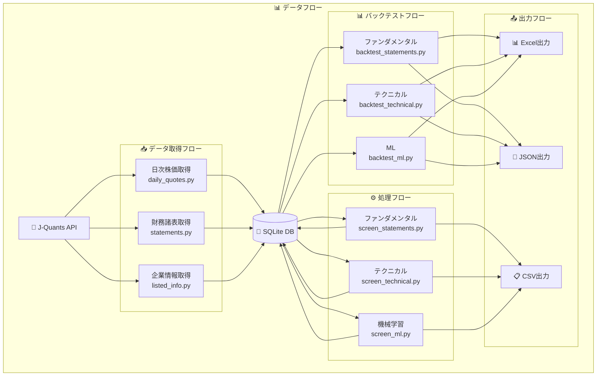
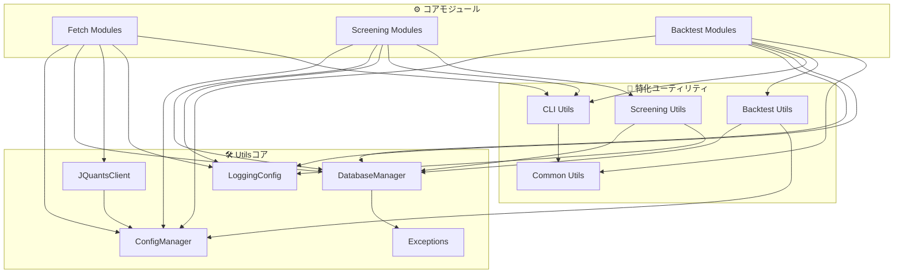
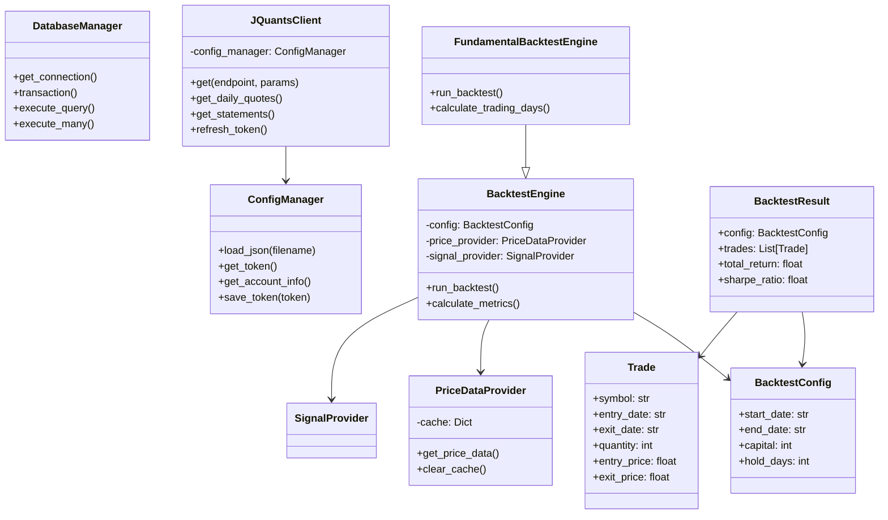
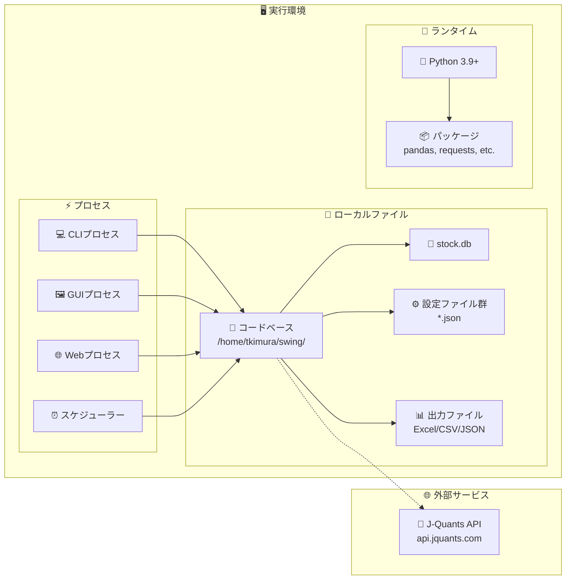
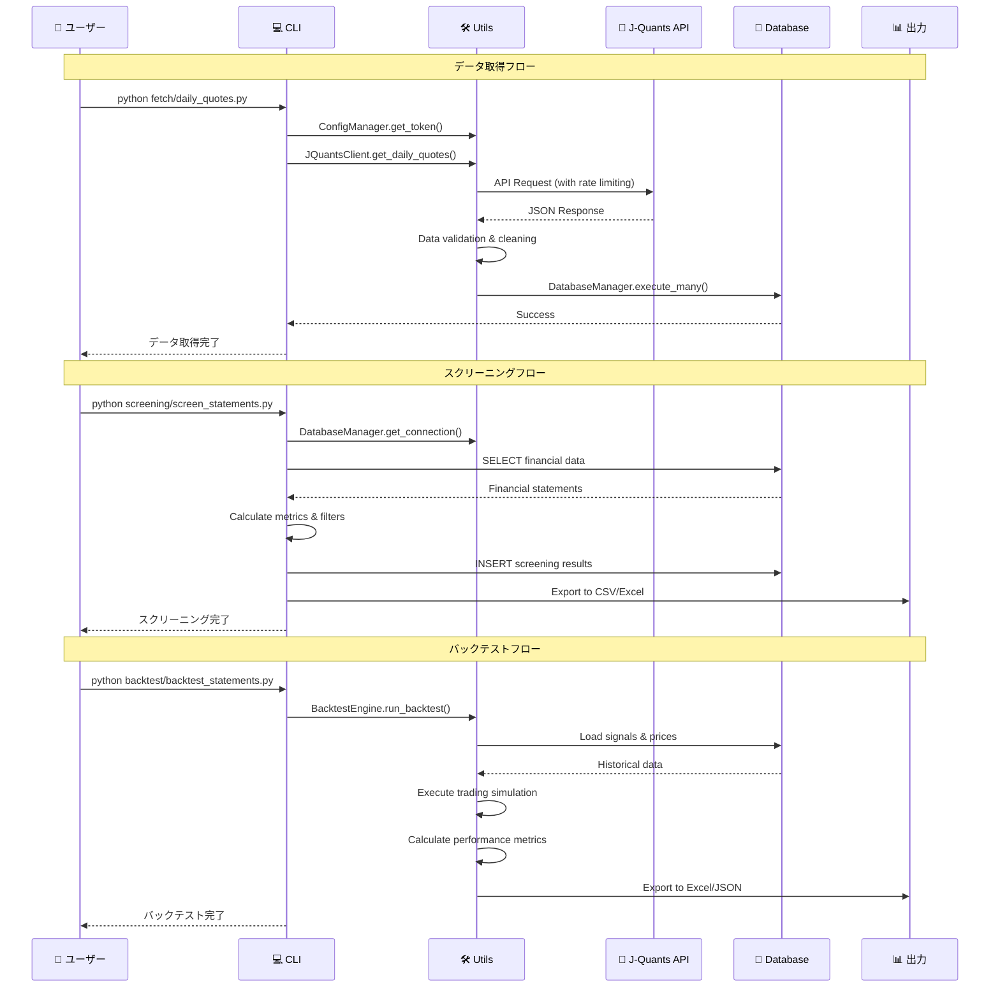

# 株式取引システム アーキテクチャ図

## システム全体構成図

```mermaid
graph TB
    %% 外部システム
    subgraph External ["🌐 外部システム"]
        JQ["🏦 J-Quants API<br/>📈 株価・財務データ"]
        UI_USERS["👥 ユーザー"]
    end

    %% アプリケーション層
    subgraph Applications ["🖥️ アプリケーション層"]
        GUI["🖼️ GUI<br/>(gui.py)"]
        WEB["🌐 Web UI<br/>(web.py)"]
        SCHEDULER["⏰ スケジューラー<br/>(scheduler.py)"]
        CLI["💻 CLI<br/>(各モジュール)"]
    end

    %% コア機能モジュール
    subgraph Core ["⚙️ コア機能モジュール"]
        FETCH["📥 データ取得<br/>/fetch/"]
        SCREENING["🔍 スクリーニング<br/>/screening/"]
        BACKTEST["📊 バックテスト<br/>/backtest/"]
    end

    %% 共通ユーティリティ
    subgraph Utils ["🛠️ 共通ユーティリティ (/utils/)"]
        CONFIG["⚙️ ConfigManager<br/>(config.py)"]
        DB["💾 DatabaseManager<br/>(db_utils.py)"]
        JQCLIENT["🔌 JQuantsClient<br/>(jquants_client.py)"]
        LOG["📝 ログ設定<br/>(logging_config.py)"]
        CLI_UTILS["🖥️ CLI共通<br/>(cli_utils.py)"]
        COMMON["🔧 共通関数<br/>(common.py)"]
        SCREEN_UTILS["🔍 スクリーニング共通<br/>(screening_utils.py)"]
        BT_UTILS["📊 バックテスト共通<br/>(backtest_utils.py)"]
        EXCEPTIONS["⚠️ 例外定義<br/>(exceptions.py)"]
    end

    %% データベース
    subgraph Database ["💾 データベース層"]
        SQLITE["📁 SQLite DB<br/>(stock.db)"]
        subgraph Tables ["テーブル"]
            PRICES["📈 prices<br/>(日次株価)"]
            STATEMENTS["📋 statements<br/>(財務諸表)"]
            LISTED["🏢 listed_info<br/>(企業情報)"]
            FUND_SIG["🎯 fundamental_signals<br/>(ファンダメンタル)"]
            TECH_SIG["📊 technical_indicators<br/>(テクニカル)"]
        end
    end

    %% 設定ファイル
    subgraph Config ["📋 設定ファイル"]
        IDTOKEN["🔑 idtoken.json<br/>(API認証)"]
        ACCOUNT["👤 account.json<br/>(アカウント)"]
        THRESHOLDS["📏 thresholds.json<br/>(閾値設定)"]
    end

    %% 接続関係
    UI_USERS --> GUI
    UI_USERS --> WEB
    UI_USERS --> CLI

    GUI --> FETCH
    GUI --> SCREENING
    GUI --> BACKTEST
    WEB --> FETCH
    WEB --> SCREENING
    WEB --> BACKTEST
    CLI --> FETCH
    CLI --> SCREENING
    CLI --> BACKTEST
    SCHEDULER --> FETCH

    FETCH --> Utils
    SCREENING --> Utils
    BACKTEST --> Utils

    CONFIG --> IDTOKEN
    CONFIG --> ACCOUNT
    CONFIG --> THRESHOLDS

    JQCLIENT --> JQ
    JQCLIENT --> CONFIG
    DB --> SQLITE

    Utils --> Database

    SQLITE --> PRICES
    SQLITE --> STATEMENTS
    SQLITE --> LISTED
    SQLITE --> FUND_SIG
    SQLITE --> TECH_SIG
```

## データフロー図

```mermaid
flowchart TD
    %% データフロー
    subgraph DataFlow ["📊 データフロー"]
        JQ_API["🏦 J-Quants API"]

        subgraph FetchFlow ["📥 データ取得フロー"]
            DQ["日次株価取得<br/>daily_quotes.py"]
            ST["財務諸表取得<br/>statements.py"]
            LI["企業情報取得<br/>listed_info.py"]
        end

        subgraph ProcessFlow ["⚙️ 処理フロー"]
            FUND["ファンダメンタル<br/>screen_statements.py"]
            TECH["テクニカル<br/>screen_technical.py"]
            ML["機械学習<br/>screen_ml.py"]
        end

        subgraph BacktestFlow ["📊 バックテストフロー"]
            BT_FUND["ファンダメンタル<br/>backtest_statements.py"]
            BT_TECH["テクニカル<br/>backtest_technical.py"]
            BT_ML["ML<br/>backtest_ml.py"]
        end

        subgraph OutputFlow ["📤 出力フロー"]
            EXCEL["📊 Excel出力"]
            JSON["📄 JSON出力"]
            CSV["📋 CSV出力"]
        end

        DATABASE[(💾 SQLite DB)]
    end

    %% フロー接続
    JQ_API --> DQ
    JQ_API --> ST
    JQ_API --> LI

    DQ --> DATABASE
    ST --> DATABASE
    LI --> DATABASE

    DATABASE --> FUND
    DATABASE --> TECH
    DATABASE --> ML

    FUND --> DATABASE
    TECH --> DATABASE
    ML --> DATABASE

    DATABASE --> BT_FUND
    DATABASE --> BT_TECH
    DATABASE --> BT_ML

    BT_FUND --> EXCEL
    BT_FUND --> JSON
    BT_TECH --> EXCEL
    BT_TECH --> JSON
    BT_ML --> EXCEL
    BT_ML --> JSON

    FUND --> CSV
    TECH --> CSV
    ML --> CSV
```

## 共通ユーティリティ依存関係図

```mermaid
graph TD
    subgraph UtilsCore ["🛠️ Utilsコア"]
        CONFIG["ConfigManager"]
        DB["DatabaseManager"]
        JQCLIENT["JQuantsClient"]
        LOG["LoggingConfig"]
        EXCEPTIONS["Exceptions"]
    end

    subgraph UtilsSpecialized ["🔧 特化ユーティリティ"]
        CLI_UTILS["CLI Utils"]
        COMMON["Common Utils"]
        SCREEN_UTILS["Screening Utils"]
        BT_UTILS["Backtest Utils"]
    end

    subgraph CoreModules ["⚙️ コアモジュール"]
        FETCH_MOD["Fetch Modules"]
        SCREEN_MOD["Screening Modules"]
        BT_MOD["Backtest Modules"]
    end

    %% 依存関係
    JQCLIENT --> CONFIG
    DB --> EXCEPTIONS
    SCREEN_UTILS --> DB
    SCREEN_UTILS --> LOG
    BT_UTILS --> DB
    BT_UTILS --> CONFIG
    CLI_UTILS --> COMMON

    FETCH_MOD --> CONFIG
    FETCH_MOD --> DB
    FETCH_MOD --> JQCLIENT
    FETCH_MOD --> LOG
    FETCH_MOD --> CLI_UTILS

    SCREEN_MOD --> CONFIG
    SCREEN_MOD --> DB
    SCREEN_MOD --> LOG
    SCREEN_MOD --> CLI_UTILS
    SCREEN_MOD --> SCREEN_UTILS

    BT_MOD --> CONFIG
    BT_MOD --> DB
    BT_MOD --> LOG
    BT_MOD --> CLI_UTILS
    BT_MOD --> BT_UTILS
    BT_MOD --> COMMON
```

## クラス関係図（主要クラス）

```mermaid
classDiagram
    %% コア管理クラス
    class ConfigManager {
        +load_json(filename)
        +get_token()
        +get_account_info()
        +save_token(token)
    }

    class DatabaseManager {
        +get_connection()
        +transaction()
        +execute_query()
        +execute_many()
    }

    class JQuantsClient {
        -config_manager: ConfigManager
        +get(endpoint, params)
        +get_daily_quotes()
        +get_statements()
        +refresh_token()
    }

    %% バックテストエンジン
    class BacktestEngine {
        -config: BacktestConfig
        -price_provider: PriceDataProvider
        -signal_provider: SignalProvider
        +run_backtest()
        +calculate_metrics()
    }

    class FundamentalBacktestEngine {
        +run_backtest()
        +calculate_trading_days()
    }

    class PriceDataProvider {
        -cache: Dict
        +get_price_data()
        +clear_cache()
    }

    %% データクラス
    class BacktestConfig {
        +start_date: str
        +end_date: str
        +capital: int
        +hold_days: int
    }

    class Trade {
        +symbol: str
        +entry_date: str
        +exit_date: str
        +quantity: int
        +entry_price: float
        +exit_price: float
    }

    class BacktestResult {
        +config: BacktestConfig
        +trades: List[Trade]
        +total_return: float
        +sharpe_ratio: float
    }

    %% 関係性
    JQuantsClient --> ConfigManager
    BacktestEngine --> BacktestConfig
    BacktestEngine --> PriceDataProvider
    BacktestEngine --> SignalProvider
    FundamentalBacktestEngine --|> BacktestEngine
    BacktestResult --> BacktestConfig
    BacktestResult --> Trade
```

## デプロイメント図

```mermaid
flowchart LR
    subgraph Environment ["🖥️ 実行環境"]
        subgraph LocalFiles ["📁 ローカルファイル"]
            CODEBASE["📂 コードベース<br/>/home/tkimura/swing/"]
            DB_FILE["💾 stock.db"]
            CONFIG_FILES["⚙️ 設定ファイル群<br/>*.json"]
            OUTPUTS["📊 出力ファイル<br/>Excel/CSV/JSON"]
        end

        subgraph Runtime ["🏃 ランタイム"]
            PYTHON["🐍 Python 3.9+"]
            PACKAGES["📦 パッケージ<br/>pandas, requests, etc."]
        end

        subgraph Processes ["⚡ プロセス"]
            CLI_PROC["💻 CLIプロセス"]
            GUI_PROC["🖼️ GUIプロセス"]
            WEB_PROC["🌐 Webプロセス"]
            SCHED_PROC["⏰ スケジューラー"]
        end
    end

    subgraph ExternalServices ["🌐 外部サービス"]
        JQUANTS_API["🏦 J-Quants API<br/>api.jquants.com"]
    end

    %% 接続
    CLI_PROC --> CODEBASE
    GUI_PROC --> CODEBASE
    WEB_PROC --> CODEBASE
    SCHED_PROC --> CODEBASE

    CODEBASE --> DB_FILE
    CODEBASE --> CONFIG_FILES
    CODEBASE --> OUTPUTS

    PYTHON --> PACKAGES

    CODEBASE -.-> JQUANTS_API
```

## 運用フロー図

```mermaid
sequenceDiagram
    participant User as 👤 ユーザー
    participant CLI as 💻 CLI
    participant Utils as 🛠️ Utils
    participant JQ as 🏦 J-Quants API
    participant DB as 💾 Database
    participant Output as 📊 出力

    Note over User, Output: データ取得フロー
    User->>CLI: python fetch/daily_quotes.py
    CLI->>Utils: ConfigManager.get_token()
    CLI->>Utils: JQuantsClient.get_daily_quotes()
    Utils->>JQ: API Request (with rate limiting)
    JQ-->>Utils: JSON Response
    Utils->>Utils: Data validation & cleaning
    Utils->>DB: DatabaseManager.execute_many()
    DB-->>CLI: Success
    CLI-->>User: データ取得完了

    Note over User, Output: スクリーニングフロー
    User->>CLI: python screening/screen_statements.py
    CLI->>Utils: DatabaseManager.get_connection()
    CLI->>DB: SELECT financial data
    DB-->>CLI: Financial statements
    CLI->>CLI: Calculate metrics & filters
    CLI->>DB: INSERT screening results
    CLI->>Output: Export to CSV/Excel
    CLI-->>User: スクリーニング完了

    Note over User, Output: バックテストフロー
    User->>CLI: python backtest/backtest_statements.py
    CLI->>Utils: BacktestEngine.run_backtest()
    Utils->>DB: Load signals & prices
    DB-->>Utils: Historical data
    Utils->>Utils: Execute trading simulation
    Utils->>Utils: Calculate performance metrics
    Utils->>Output: Export to Excel/JSON
    CLI-->>User: バックテスト完了
```
